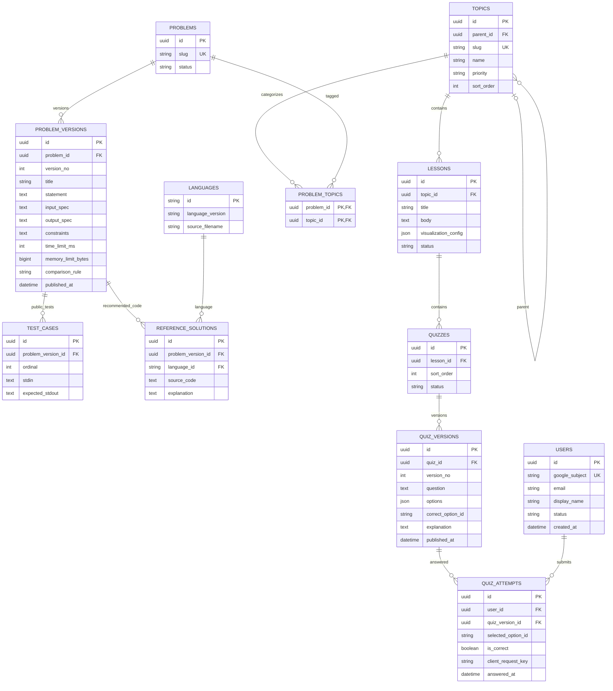
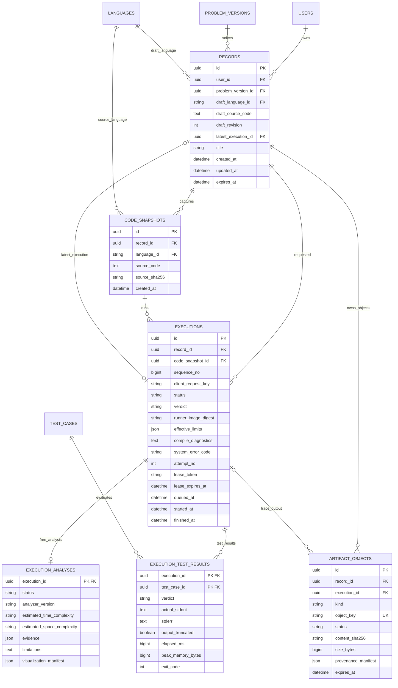
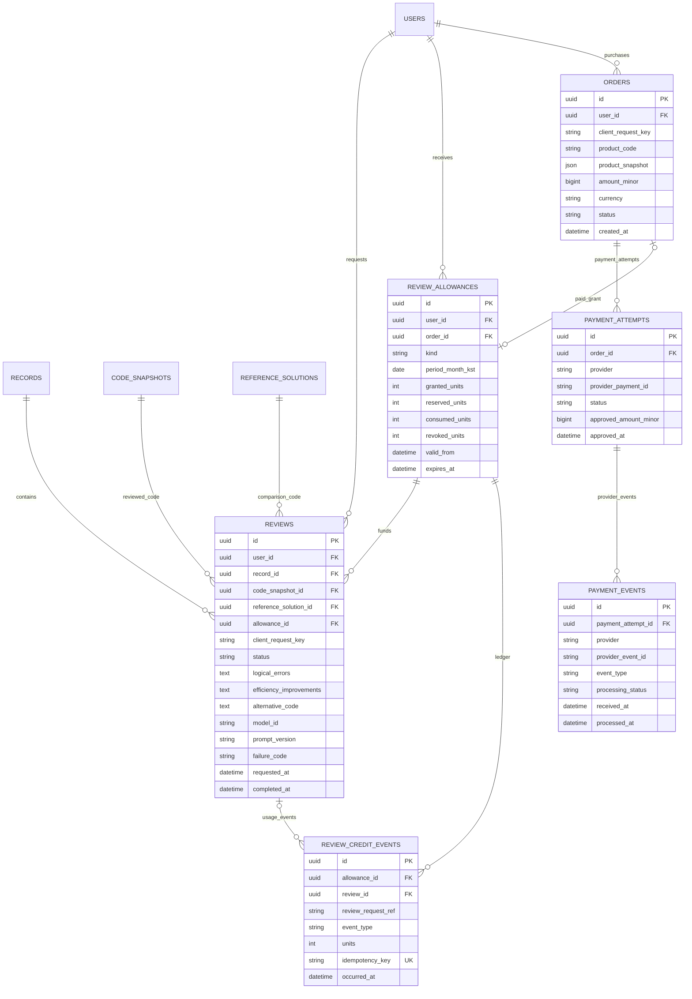

# 알고리즘 학습 앱 ERD v1

작성일: 2026-09-18 · 상태: 논리 설계 초안 · 기준: 대화에서 합의한 SRS

서버리스 여부와 독립적인 관계형 데이터 모델이다. PostgreSQL을 물리 설계 후보로 가정하되 아직 DB 제품을 확정하지 않는다. 실제 테이블 생성이나 배포는 수행하지 않았다.

## 1. 설계 기준

- Google 로그인 사용자만 이용한다. 이메일이 아니라 Google 계정의 `sub`를 사용자 식별자로 사용한다.
- 문제를 선택한 뒤 Python 3.10, C++20, Java 21 중 하나로 단일 파일 전체 프로그램을 작성한다.
- 모든 테스트는 공개하며 출력은 엄격하게 비교한다. 무료 분석에는 LLM을 사용하지 않는다.
- 저장 기록 한 건은 하나의 문제 풀이 작업이다. 재실행은 동일 기록의 최신 실행을 교체한다.
- 리뷰는 리뷰 당시 사용자 코드, 문제 내용, 해당 언어의 권장 코드와 연결한다.
- 기록은 최대 100건, 보관은 30일이며 삭제 복구는 제공하지 않는다.
- 무료 리뷰는 KST 매월 1일 00시 기준 3건이다. 리뷰 생성 성공 시 소비하며 실패 시 예약분을 반환한다. 이월하지 않는다.
- Android는 학습 설명과 퀴즈만 제공한다. 코드 실행·리뷰·PDF 기능은 웹에 제공한다.
- 큰 실행 추적 및 PDF 파일은 객체 스토리지에 두고 DB에는 메타데이터와 객체 키를 저장한다.

아래 다이어그램은 가독성을 위해 영역별로 나눴다. 같은 이름은 동일한 테이블이다. `PK`는 기본 키, `FK`는 외래 키, `UK`는 고유 키다. ERD에는 주요 컬럼만 표시하고 세부 제약은 뒤에서 설명한다.

## 2. 사용자·문제·학습 콘텐츠

콘텐츠 규칙:

- `LANGUAGES.id` 초기 값은 `python_3_10`, `cpp_20`, `java_21`이다. C++20은 언어 표준이며 실제 컴파일러 빌드는 실행 이미지 버전으로 별도 관리한다.
- `TOPICS.priority`는 P0/P1/P2, `parent_id`는 선택 값이다. 부모 순환은 금지한다. 문제에는 여러 주제를 연결할 수 있다.
- `(problem_id, version_no)`, `(problem_version_id, ordinal)`, `(problem_version_id, language_id)`는 각각 고유하다.
- 게시된 문제 버전·테스트·권장 코드는 불변이다. 수정 시 문제 버전을 새로 발행한다. 최신 버전은 게시 버전 번호로 조회하고 기존 풀이를 자동 이동하지 않는다.
- 문제 버전 게시 전 지원 언어 3개의 권장 코드와 1개 이상의 테스트가 존재하는지 검증한다. 공개 테스트만 있으므로 `is_hidden` 필드는 두지 않는다.
- 초기 실행 제한은 테스트당 `10000ms`, 메모리는 `536870912 bytes`다. 메모리 계측 범위와 실행 정책은 물리 설계 전에 실험으로 확정한다.
- 출력 비교 규칙은 `EXACT`다. 비교 전에 공백·개행을 제거하지 않는다. UTF-8 인코딩 및 개행 취급 규격은 실행기 명세에 고정한다.
- 퀴즈는 우선 단일 선택형으로 설계한다(제안). `options`는 안정적인 옵션 ID와 문구 배열이며 정답 ID의 존재·옵션 ID 중복을 게시 시 검증한다.
- 퀴즈 개정 시 새 버전을 생성한다. 사용자가 답했던 문항·정답·해설은 당시 버전으로 해석한다. 정답 여부는 서버에서 산출한다.
- `(quiz_id, version_no)`, `(user_id, client_request_key)`는 고유하다. 같은 퀴즈의 재도전은 새 요청 키로 별도 저장할 수 있다.
- 학습 진도 테이블은 필수 요구사항이 아니어서 제외했다. 퀴즈 응시 기록을 저장하는 것은 복습을 위한 설계 제안이며 코드 기록 100건 제한과는 별개다.

## 3. 저장 기록·코드·실행·분석

핵심 구분:

- `RECORDS`: 사용자 목록에 보이는 저장 단위. 작성 중 코드를 자동 저장하고 최대 100건으로 센다. `draft_revision`으로 오래된 자동 저장 요청이 최신 내용을 덮어쓰지 못하게 한다.
- `CODE_SNAPSHOTS`: 실행 또는 리뷰를 요청하는 시점의 불변 코드. 아직 실행하지 않은 코드도 리뷰할 수 있도록 실행과 독립적으로 둔다.
- `EXECUTIONS`: 비동기 실행 요청 단위. 재실행은 새 실행 요청이지만 새 저장 기록은 아니다. 동일 요청의 네트워크 재시도는 같은 실행 ID를 반환한다.
- `EXECUTION_TEST_RESULTS`: 공개 테스트별 실제 출력, 오류, 실행 시간, 최대 메모리. 출력 제한 초과로 잘린 경우 전체 출력이라고 표시하지 않는다. 출력 제한 값은 추후 확정한다.
- `EXECUTION_ANALYSES`: LLM을 사용하지 않는 분석 결과. 추정 복잡도와 실제 실행 측정치를 분리한다. 분석 불가를 정상 상태 `UNSUPPORTED`로 표현하고 복잡도 필드는 비워둔다. 오답 판정과도 구분한다.
- `ARTIFACT_OBJECTS`: 실행 추적·시각화 스냅샷·PDF의 스토리지 위치. `execution_id`는 PDF 등 실행 하나에 종속되지 않는 객체에서는 선택 값이다. `provenance_manifest`에 PDF가 포함한 실행·코드·리뷰 식별자와 해시를 남긴다. 공개 URL이나 서명 URL 자체를 영구 저장하지 않는다.

무결성 및 상태:

1. `(record_id, sequence_no)`, `(record_id, client_request_key)`는 각각 고유하다. 최신 실행은 요청 접수 순서 기준이다. 예전 작업이 늦게 끝나도 최신 포인터를 덮어쓰지 않는다.
2. `latest_execution_id`가 있으면 반드시 같은 기록에 속한 실행이어야 한다. 실행의 코드 스냅샷도 같은 기록에 속해야 한다. 복합 FK 또는 DB 트리거로 강제한다.
3. 테스트 결과의 테스트 케이스는 해당 기록에 고정된 문제 버전에 속해야 한다. 다른 문제 버전의 테스트를 연결할 수 없다.
4. 실행 상태는 `QUEUED → RUNNING → SUCCEEDED / FAILED / CANCELED`다. `SUCCEEDED`는 채점 처리 완료를 뜻하며 정답 여부는 `verdict`의 `AC / WA / CE / RE / TLE / MLE / OUTPUT_LIMIT` 등으로 구분한다. 시스템 장애는 `FAILED + system_error_code`다.
5. `effective_limits`는 그 실행에 적용한 테스트 제한·컴파일 제한·제출 전체 제한·출력/추적 제한·단일 스레드 정책을 보존한다. `runner_image_digest`로 언어 런타임·컴파일러·추적기의 빌드를 식별한다.
6. 워커 재처리는 동일 실행 ID 아래에서 수행한다. 증가하는 시도 번호와 임대 토큰으로 이전 워커의 늦은 결과 반영을 차단한다. 테스트 결과를 시도 간 섞지 않고 최종 커밋한다.
7. 사용자 프로그램의 단일 스레드 정책과 JVM 등 런타임 내부 스레드는 실행기에서 구분한다. DB 컬럼만으로 제한을 보장하지 않는다.

저장 수명 — 아래 만료 기준은 설계 제안:

- `expires_at = created_at + 30일`로 고정한다. 자동 저장·재실행으로 30일이 계속 연장되지 않도록 한다. 재실행 시 만료를 연장할지는 아직 사용자 확정이 필요한 정책이다.
- 기록 101번째 생성 시 같은 사용자의 기록 변경을 트랜잭션으로 직렬화하고 `(created_at, id)` 기준 가장 오래된 기록을 삭제한다. 동시 생성으로 100건을 넘기지 않게 한다.
- 재실행 후 UI에는 최신 실행만 노출한다. 비최신 실행의 큰 추적·출력은 작업 종료 후 정리하고 리뷰가 참조하는 코드 스냅샷은 기록 만료까지 보존한다. 이전 실행의 내부 진단 메타데이터 보관 기간은 별도 운영 정책으로 정한다.
- 명시적 삭제·30일 만료·100건 초과 삭제는 같은 정리 절차를 사용한다. 진행 중 작업을 취소하고 임대 토큰을 무효화해 결과가 삭제한 기록을 되살리지 못하게 한다.
- DB에서 접근을 즉시 차단하고 연결된 코드·실행·분석·리뷰 내용·PDF를 제거한다. 객체 키는 별도 삭제 작업에 넘겨 스토리지 삭제를 재시도한다. 복구 API는 제공하지 않는다.
- 삭제된 기록의 리뷰 소비 내역·결제 내역은 남는다. 이들에는 원본 코드를 저장하지 않는다. 운영 백업의 잔존 기간은 별도 정책으로 확정한다.

## 4. 리뷰·이용량·결제

리뷰의 세 입력 연결:

1. 사용자 코드: `REVIEWS.code_snapshot_id → CODE_SNAPSHOTS.source_code`.
2. 권장 코드: `REVIEWS.reference_solution_id → REFERENCE_SOLUTIONS.source_code`.
3. 문제: 해당 권장 코드의 `problem_version_id → PROBLEM_VERSIONS`의 지문·입출력 규격·제약.

권장 코드는 코드 스냅샷의 언어 및 기록의 문제 버전과 반드시 일치해야 한다. 해당 관계는 복합 FK 또는 DB 트리거로 검증한다. 테스트 결과·계정 정보·결제 정보는 LLM의 추가 입력으로 전달하지 않는다. LLM 공급자와 가격은 미정이며 모델·프롬프트 버전은 결과 추적을 위한 운영 메타데이터다.

이용량 규칙:

- `REVIEW_ALLOWANCES`는 무료 월간 3건 또는 구매로 부여한 이용권이다. 별도 상품 테이블을 확정하지 않고 주문에 구매 당시 상품 조건을 스냅샷으로 저장한다.
- 무료분은 `(user_id, period_month_kst)`에 대해 `kind=FREE_MONTHLY` 조건부 고유 제약을 둔다. 매월 사용 시 지연 생성해도 되므로 전체 사용자 갱신 배치에 의존하지 않는다.
- 기간은 KST 월초부터 다음 월초 직전까지다. 실제 시각 컬럼은 UTC 시각을 저장한다. 유효 기간이 지나면 잔여분을 다음 달로 옮기지 않는다.
- 요청 접수 시 유효한 이용권의 1건을 원자적으로 `RESERVE`한다. 성공하면 `CONSUME`, 확정 실패나 취소면 `RELEASE`한다. 요청 중 중복 클릭이나 재전달은 같은 리뷰 ID로 응답한다.
- `granted_units >= reserved_units + consumed_units + revoked_units`와 모든 수량의 비음수를 강제한다. 원장 추가와 카운터 갱신은 같은 트랜잭션에서 수행한다.
- `(user_id, client_request_key)`는 리뷰·주문 각각에서 고유하다. 리뷰마다 하나의 예약, 그리고 소비 또는 반환 중 하나만 허용한다. 소비와 반환을 모두 커밋하지 못하도록 리뷰 상태를 잠그고 전이한다.
- 월말에 예약하고 다음 달 완료된 리뷰는 요청 시 예약한 이용권에서 정산한다(제안). 실패 반환이 이미 만료된 이용권을 다시 사용 가능하게 만들지는 않는다.
- 리뷰 삭제 시 `REVIEW_CREDIT_EVENTS.review_id`만 NULL로 바꾸고 비콘텐츠 추적값 `review_request_ref`와 이용량은 유지한다. 기록 삭제가 무료 횟수를 복구하지 않는다.
- 구매분의 월간 만료도 표현할 수 있지만 상품별 수량·유효 기간·환불·무료분과 구매분의 차감 우선순위는 가격 정책과 함께 확정한다. 기본 제안은 무료분 우선, 그 다음 만료가 빠른 구매분이다.
- `REVIEWS.status`: `QUEUED / RUNNING / SUCCEEDED / FAILED / CANCELED`. 성공 시 세 결과 필드를 저장하고 이용량 소비까지 한 트랜잭션으로 반영한다. 리뷰 큐 재시도는 새 이용량을 예약하지 않는다.

결제 규칙:

- 한 주문에 여러 결제 시도가 있을 수 있다. 주문당 이용권 부여는 한 번만 가능하도록 `REVIEW_ALLOWANCES.order_id`에 NULL 허용 고유 제약을 둔다.
- `(provider, provider_payment_id)`와 `(provider, provider_event_id)`는 각각 고유하다. 다른 PG의 같은 ID와 충돌하지 않도록 한다.
- PG 웹훅은 서명·결제 식별자·주문 금액·통화를 확인한 후 처리한다. 웹 결제 완료 화면만으로 이용권을 부여하지 않는다.
- 결제 이벤트 저장, 주문 승인, 이용권 부여를 중복 처리에 안전하게 구성한다. 실패 이벤트가 늦게 도착해 이미 승인된 주문을 실패로 되돌리지 않도록 상태 전이를 제한한다.
- 환불은 이용권의 미사용분 취소와 연결한다. 부분 환불·사용 후 환불을 허용할 경우 환불 거래 테이블과 관련 제약을 추가해야 한다. 현재 정책 미정이므로 v1에서 그 동작을 약속하지 않는다.
- Google Drive 저장은 요청 시 동의를 받아 처리한다. Google 로그인 정보와 Drive 쓰기 권한을 동일시하지 않는다. 장기 토큰 보관은 요구되지 않았으므로 토큰 테이블을 두지 않는다.

## 5. 테이블 목록과 주요 인덱스

총 24개 논리 테이블:

- 사용자·콘텐츠 12개: `users`, `languages`, `topics`, `lessons`, `problems`, `problem_topics`, `problem_versions`, `test_cases`, `reference_solutions`, `quizzes`, `quiz_versions`, `quiz_attempts`.
- 코드 실행 6개: `records`, `code_snapshots`, `executions`, `execution_test_results`, `execution_analyses`, `artifact_objects`.
- 리뷰·결제 6개: `reviews`, `review_allowances`, `review_credit_events`, `orders`, `payment_attempts`, `payment_events`.

작업 전달용 outbox는 위 개수에 포함하지 않았다. 운영용 임대·전역 실행 슬롯·스토리지 삭제 작업·감사 로그도 별도 인프라 설계 대상으로 분리한다.

우선 인덱스:

- `records(user_id, created_at, id)`: 목록 조회와 100건 초과 시 가장 오래된 기록 선정.
- `records(expires_at)`: 만료 정리. 만료 전용 작업을 놓쳐도 API 조회 단계에서 만료 여부를 검사한다.
- `executions(record_id, sequence_no DESC)`: 최신 요청 및 재처리 식별.
- `executions(status, lease_expires_at)`: 중단된 작업 회수.
- `reviews(record_id, requested_at DESC)`: 기록별 리뷰 목록.
- `review_allowances(user_id, expires_at)`: 유효 이용권 선택.
- `quiz_attempts(user_id, quiz_version_id, answered_at DESC)`: 퀴즈 복습.
- 모든 참조 FK에 필요한 인덱스, 앞서 명시한 고유 제약을 추가한다.

## 6. 트랜잭션·접근 경계

- 사용자 소유 데이터는 인증된 `user_id`로 필터링한다. 리뷰의 사용자·기록 소유자·이용권 소유자는 동일해야 한다. 클라이언트가 전달한 사용자 ID를 신뢰하지 않는다.
- 실행 접수는 코드 스냅샷 생성, 실행 생성, 최신 실행 포인터 갱신, 작업 전달 의도 저장을 한 트랜잭션으로 처리한다. 실제 큐 전송은 재시도 가능한 outbox 또는 DB 변경 스트림으로 연결한다. DB 커밋 후 큐 전송 실패로 영원히 대기하는 작업을 방지한다.
- 리뷰 접수도 코드 스냅샷·리뷰 생성·이용권 예약·작업 전달을 함께 처리한다.
- 자동 저장 중에는 낙관적 잠금으로 충돌을 감지한다. 실행/리뷰 요청은 서버가 실제 수락한 코드 내용과 리비전을 스냅샷으로 고정한다.
- VM 최대 동시 실행 10개는 작업 관리자의 전역 임대 슬롯으로 강제한다. `COUNT(RUNNING)`을 읽는 것만으로 제어하지 않는다.
- 삭제 정리와 진행 중 작업 결과 커밋을 직렬화한다. 외부 객체 삭제 실패는 재시도하고 DB 외래 키 삭제만으로 파일 정리가 끝났다고 판단하지 않는다.

## 7. 물리 ERD/DDL 작성 전 확정할 사항

1. 기록 30일 기준: 최초 생성 시점 고정(현재 초안) 또는 마지막 실행 시점 갱신.
2. 퀴즈 유형: 현재 초안은 단일 선택형이며 복수 선택·주관식 지원 여부.
3. 구매 상품의 수량·기간·환불 규칙 및 무료/구매 이용권 차감 우선순위.
4. 테스트 실행 메모리의 계측 범위, 컴파일·출력·추적 제한.
5. 퀴즈 기록·결제 원장·운영 진단 로그·백업의 보관 기간.

이 항목들은 미정 정책이며, 확정된 SRS 조건으로 간주하지 않는다. 본 문서는 논리 ERD이므로 DB별 자료형, 복합 FK, 제약 트리거, 마이그레이션과 인덱스 DDL은 다음 단계에서 작성한다.
